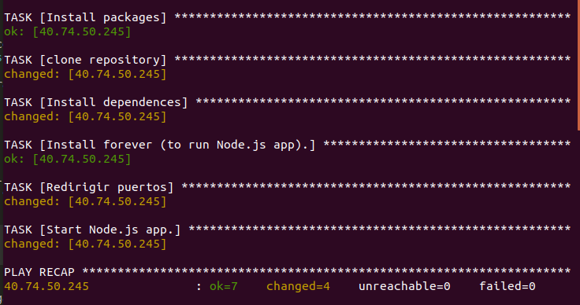
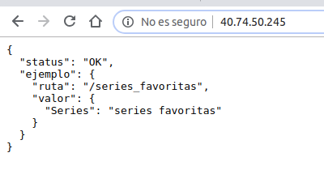
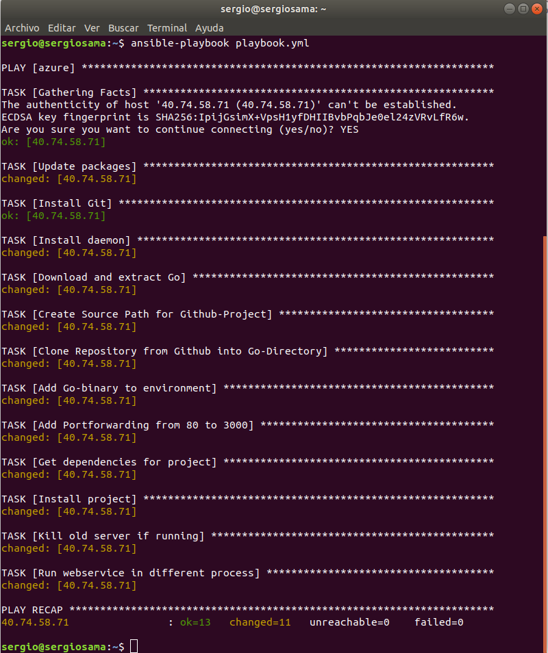
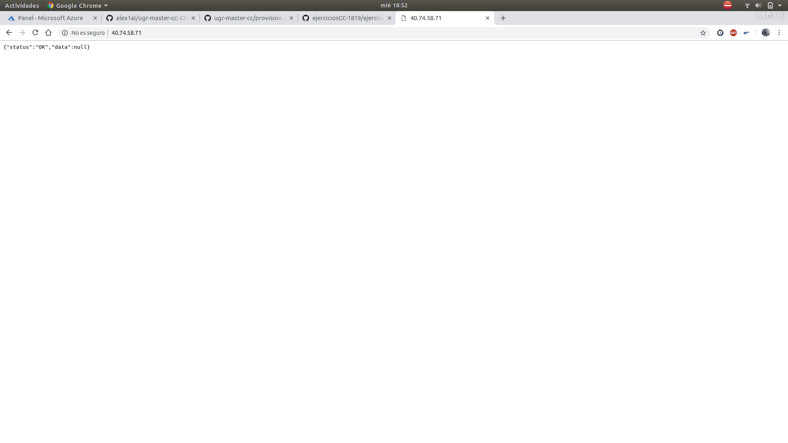

#Hito 3

Para el hito se ha desarrollado un playbook en Ansible que nos permitirá desplegar nuestro servicio en una máquina virtual de Azure.

## Maquina Virtual

La máquina virtual que se ha utilizado en Azure tiene las siguientes caracterísiticas:
- SO: Ubuntu Server 18.04 LTS
- Región: Oeste de Europa
- Autenticación: Con clave SSH
- Usuario: sergio
- Puertos abiertos: HTTP (80) y SSH (22).

Decir que se ha elegido como Sistema Operativo Ubuntu 18.04 debido a que es la versión más actual de este sistema operativo y por haber trabajado con él antes, por lo qúe me encuentro más familiarizado con él.

## Ampliación de la funcionalidad

En este caso se ha introducido una nueva clase que nos permitirá almacenar mása información de las series cuando consultemos la misma en la API.
La clase creada es [infoSerie.js](https://github.com/samahetfield/PersonalCC-1819/blob/master/infoSerie.js), con la que podremos almacenar para cada serie datos como las temporadas, su nombre, capítulos o actores.

Por lo tanto, ahora cada vez que almacenamos una serie nueva en nuestra lista de favoritos, se almacenará con toda esta información estructurada en formato JSON, en lugar de almacenar únicamente el nombre como se realizaba anteriormente.

## Ansible

Se ha utilizado Ansible para el provisionamiento.

Para usarlo, debemos instalarlo previamente y posteriormente editar el archivo ``` /etc/ansible/hosts ``` en el que tendremos que introducir la IP de nuestra máquina virtual.
Podemos crear grupos, introduciendo el nombre entre corchetes que nos ayudará a desplegar únicamente sobre aquellas direcciones que queramos.

```
	[azure]
	40.74.50.245 ansible_user=sergio

```

Al añadir estas líneas ya podremos crear nuestro playbook para desplegar sobre esta máquina virtual.
El fichero de provisionamiento hará las siguientes tareas:
- Instalar paquetes como git y npm
- Clonar el repositorio
- Instalar las dependencias
- Instalar forever, para correr nuestra aplicación NodeJS
- Redirigir los puertos para que sea accesible desde el puerto 80
- Correr la aplicación

Cuando ejecutamos el playbook, el resultado es el siguiente:



Y finalmente, podremos comprobar que funciona accediendo a nuestra dirección IP y viendo el resultado de la pantalla principal:



#Comprobación de mi provisionamiento

# Comprobación de provisionamiento de otro compañero

He comprobado el provisionamiento del compañero Alexander Manuel Josef Grimm.

Se ha creado una máquina virtual en Azure siguiendo las instrucciones que se muestran en su [documentación](https://github.com/alex1ai/ugr-master-cc/blob/gh-pages/provision.md).

Creada la máquina virtual, para probarla debemos introducir la IP de la misma dentro de nuestro archivo de hosts de Ansible y descargarnos su Playbook.

Hecho esto, tendremos que ejecutarlo y tendremos el siguiente resultado:



Como se comprueba en los resultados, vemos que se ha instalado todo lo necesario correctamente, así que únicamente vamos a pasar a acceder a la IP para ver que nos devuelve el Status OK.


