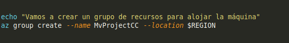

# Hito 4

## Seleccionar región del centro de datos

Como ya sabemos, Azure dispone de varias regiones de centros de datos, en los que podremos tener nuestr amáquina virtual.
Al existir las distintas regiones, es conveniente analizarlas y seleccionar una de ellas, no simplemente al azar, sino, teniendo como base algún dato que nos indique que para nuestra ubicación es mejor seleccionar una determinada.
Para el análisis de las regiones de datos, se ha utilizado una página web, llamada [Azure Speed](http://www.azurespeed.com/) que nos va a permitir ver la latencia de las distintas regiones de datos.

Como podemos ver en esta imagen, la región con menos latencia es la de "West Europe" y por lo tanto será la más indicada para nosotros y la que seleccionaremos.

## Elección de la imagen

Para la imagen de nuestra máquina virtual se ha seleccionado Ubuntu 18.04 LTS, debido a que es la imagen de Ubuntu más reciente, así como por la sencillez de uso que nos ofrece ubuntu, la sencilla configuración del mismo o la calidad de soporte del mismo, que podemos ver en la siguiente [página](https://www.g2crowd.com/products/ubuntu/reviews). Además de todo esto, le sumamos de que estamos trabajando con git y con NodeJS, los cuales vienen instalados por defecto en la imagen y no es necesario realizar instalaciones extra.

## Automatización

En nuestro script de automatización, lo que haremos será las siguientes tareas, en el orden que aparecen:

- Inidcamos al usuario que debe hacer login con su cuenta de Azure.
- Creamos un grupo de recursos si es la primera ejecución del script.
- Creamos la máquina virtual.
- Abrimos el puerto 80 para acceder vía HTTP.
- Provisionamos la máquina virtual con ansible.

La primera tarea, como ya se ha indicado, el usuario deberá hacer Login y se corresponderá con la siguiente parte del script.

Una vez que el usuario haga login con su cuenta, pasaremos a preguntar si es la primera vez que se ejecuta el script para crear el grupo de recursos o no.

Se crea un grupo de recursos llamado **MVProjectCC** con region en "West Europe", que está almacenado en una variable declarada al principio del script.

Una vez tenemos el grupo de recursos creado, podemos pasar a crear la máquina virtual.

En esta parte creamos la Máquina Virtual, donde le indicamos el grupo de recursos que usaremos,	el nombre de la máquina, la imagen que vamos a usar y por último que nos genere las claves ssh para poder acceder a ella por esta vía.

Una vez creada, filtraremos la IP pública de la máquina, haciendo uso de **jq** ya que el resultado que se nos devuelve está en formato JSON y es fácil de parsear.
Con la IP pública obtenida, la almacenaremos en una variable para poder provisionar esta máquina virtual posteriormente.

Ahora lo que haremos será abrir el puerto 80, ya que por defecto, únicamente nos ha abierto el puerto ssh y por lo tanto no podríamos acceder a ella desde nuestro navegador.

Hecho esto, llegaremos al paso final, que corresponderá con el provisionamiento de la máquina.

En esta parte, lanzaremos el playbook de ansible que creamos en el hito anterior para provisionar la máquina virtual, para ello tendremos que indicarle que lo ejecute sobre la IP que le pasamos como argumento.

Una vez ejecutado el playbook correctamente, podremos comprobar que nuestra máquina se ha creado correctamente y se ha provisionado accediendo desde nuestro navegador a la IP pública que nos ha dado.

## Salidas del script

