# Hito 5: Orquestación

## Orquestación

La orquestación de las dos máquinas virtuales se ha realizado con Vagrant y al estar utilizando Azure para alojar estas máquinas virtuales, lo vamos a ver reflejado en el Vagrantfile, ya que tendremos que indicarlo como proveedor.
Como se indica en el [Github de Azure](https://github.com/Azure/vagrant-azure) correspondente a Vagrant, lo primero que tendremos que hacer será hacer login en nuestra cuenta de azure y crear un Active Directory con acceso a la suscripción activa que tengamos con el comando ``` az ad sp create-for-rbac ```.
En la siguiente imagen vemos la salida del anterior comando:
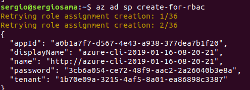

Hecho el login y creado el Active Directory, pasaremos a exportar las variables de entorno que usaremos en el Vagrantfile, como son: 
- AZURE_TENANT_ID: Correspondiente al tenant devuelto al crear el Active Directory.
- AZURE_CLIENT_ID: Correspondiente al appID devuelto al crear el Active Directory.
- AZURE_CLIENT_SECRET: Correspondiente al password devuelto al crear el Active Directory.
- AZURE_SUBSCRIPTION_ID: Correspondiente al ID de nuestra subscripción.

Para exportarlas haremos lo siguiente con cada una de ellas:
- export AZURE_TENANT_ID="........."
- export AZURE_CLIENT_ID="........."
- export AZURE_CLIENT_SECRET="........."
- export AZURE_SUBSCRIPTION_ID="........."


Antes de comenzar con el Vagrantfile, crearemos una máquina de Vagrant con el siguiente comando:
	
	vagrant box add azure https://github.com/azure/vagrant-azure/raw/v2.0/dummy.box --provider azure

Nuestro Vagrantfile tendrá que orquestar dos máquinas virtuales, una que contendrá el servicio y otra la Base de datos, por lo que será necesario que ambas máquinas se comuniquen entre sí.
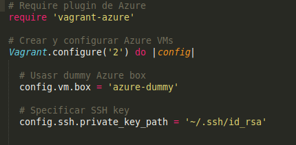

Se ha ido usando este [tutorial](https://blog.scottlowe.org/2017/12/11/using-vagrant-with-azure/) para seguir los pasos necesarios para comenzar a crear el primer Vagrantfile con una máquina.

En la anterior imagen vemos la primera parte del Vagrantfile.
En ella se pueden diferenciar cuatro principales partes, cada una correspondiente a una línea:
- La primera línea corresponderá con importar el plugin de azure.
- La segunda línea será para comenzar el Vagrantfile e indicar la versión de Vagrant que deseamos utilizar.
- La tercera línea para indicar la "dummy-box" de Azure que vamos a utilizar, que previamente hemos creado.
- La cuarta será para indicar la ruta en la que se encuentren las claves SSH.

Indicadas estas cuatro partes, se va a proceder a crear y a configurar las dos máquinas virtuales que vamos a necesitar, para ello, se ha seguido este [tutorial](https://www.vagrantup.com/docs/multi-machine/) donde se nos explica cómo configurar varias máquinas en un mismo Vagrantfile.

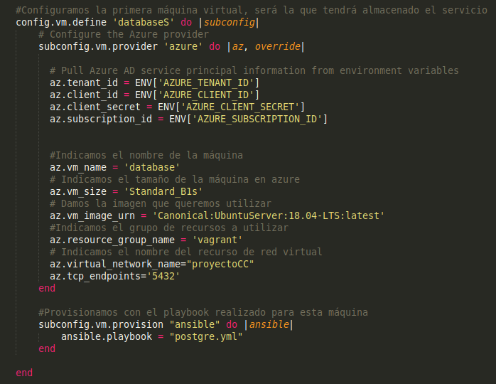

En la imagen anterior podemos ver la configuración de la primera máquina virtual que vamos a crear.
En ella tendremos que configurar que el proveedor que vamos a utilizar será Azure, así que lo indicamos con la orden siguiente:
	
	subconfig.vm.provider 'azure' do |az, override|

Posteriormente tendremos que indicar las variables que exportamos al principio del trabajo, correspondientes a nuestra cuenta y nuestro Active Directory.

Las siguientes líneas, van a corresponder con la configuración de nuestra máquina virtual, en la que iremos indicando el nombre de la máquina, el tamaño, la imagen que correrá y el grupo de recursos.

Antes de salir de la configuración de Azure, tenemos las dos últimas líneas, que son las siguientes:

	az.virtual_network_name="proyectoCC"
	az.tcp_endpoints='5432'

Esto se ha consultado en el [Github de Azure](https://github.com/Azure/vagrant-azure) donde nos indican que podremos crear una red virtual con ``` virtual_network_name ``` para que ambas máquinas se comuniquen entre sí y seguidamente abrimos los puertos necesarios, en este caso, como es el de la base de datos, sólamente abriremos el puerto de PostgreSQL que es el 5432.

Al crear esta red virtual, Azure asigna una IP privada a cada máquina que pertenezca a esta red, en el caso de la primera correspondiente a la base de datos será 10.0.0.5 y la siguiente será 10.0.0.4.

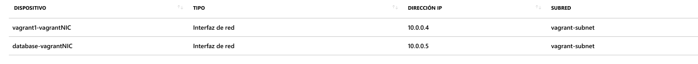


Tras esto, llegamos a la parte de provisión, donde indicaremos que usaremos Ansible para la provisión y el [playbook](https://github.com/samahetfield/PersonalCC-1819/blob/master/orquestacion/postgre.yml) que debe utilizar.

La configuración de la segunda máqunia es exactamente igual que lo que se ha visto, así que no entraremos en mucho detalle sobre ella.

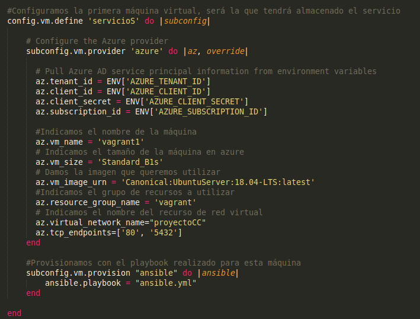

Lo único a destacar es que como esta segunda máquina es la del servicio, abriremos el puerto 80 para que se pueda acceder desde el navegador con la dirección IP que nos crea Azure.

Visto el Vagrantfile vamos a ver las salidas de la ejecución del mismo y comprobar que funciona correctamente.

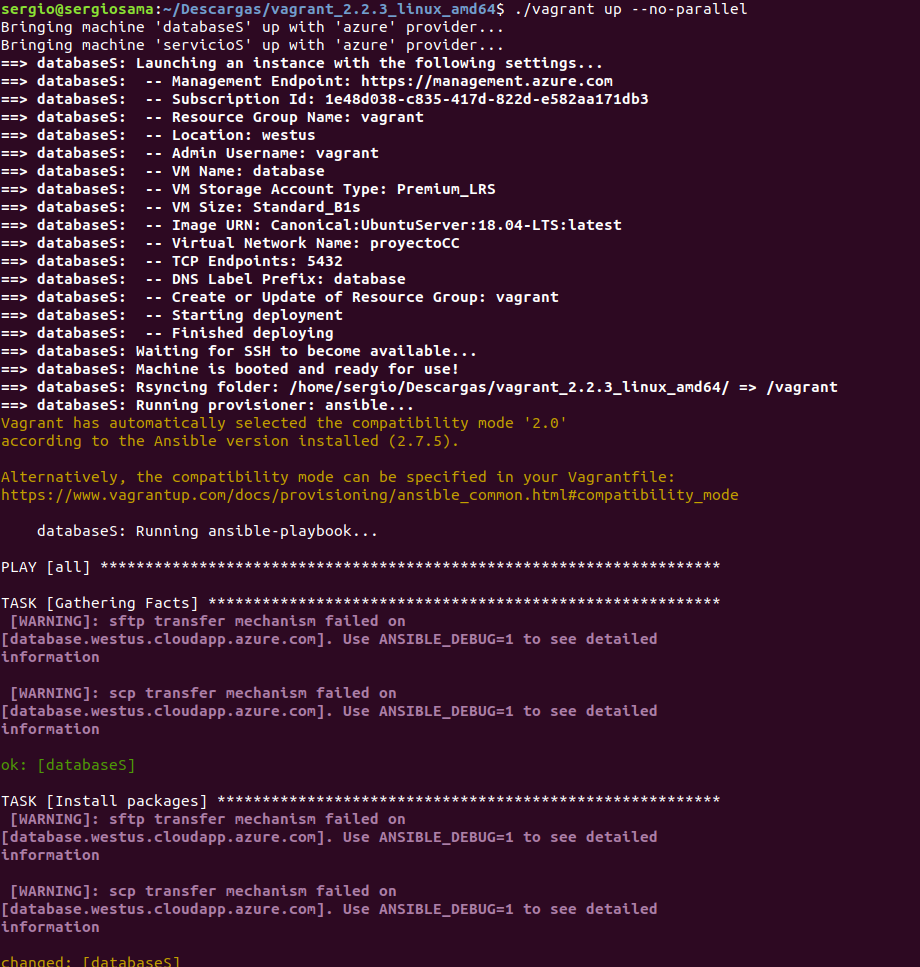

En esta imagen vemos cómo se despliega la primera máquina virtual y comienza el provisionamiento con Ansible. Ha sido necesario ejecutar el comando con ``` --no-parallel ``` ya que en paralelo fallaba el despliegue.

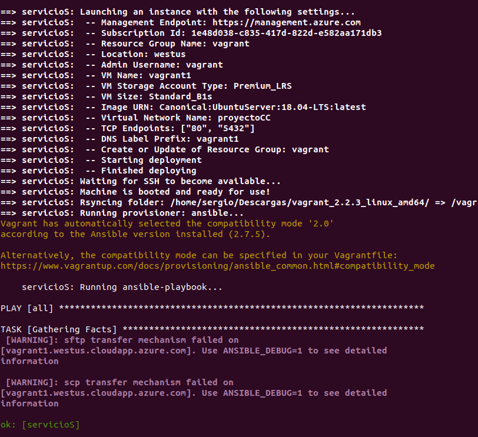

Terminado el provisionamiento de ambas máquinas, accederemos a la IP para ver que se puede acceder por el puerto 80 y que todo está correctamente.

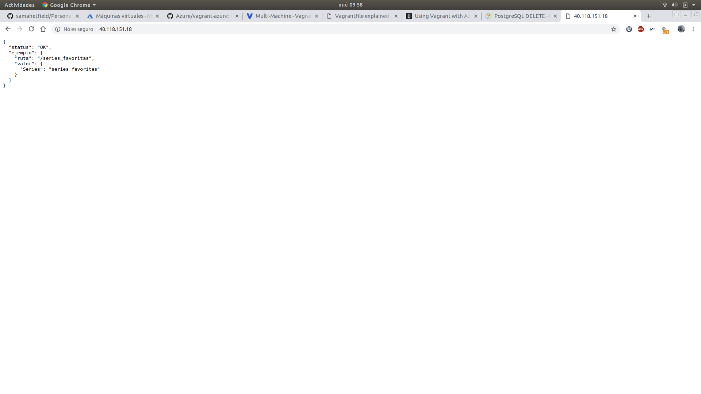


## Nueva funcionalidad añadida

Para esta entrega se han añadido nuevas funcionalidades a la aplicación, para irnos acercando a la entrega final.
Lo primero que se ha añadido ha sido el uso de la **API TVDB** para obtener datos de las series que el usuario quiere almacenar.

	tvdb.getSeriesByName(serie)
    	.then((result) => {	 ... }

Con la llamada ala función que vemos aquí, podemos obtener datos de la serie que pasamos como parámetro, como puede ser su nombre, el identificador, actores, una sinopsis, así como algunas otras cosas más.

La principal dificultad que encontré al trabajar con esta API fue aprender a utilizar las llamadas asíncronas, ya que estos **then/catch** se ejecutaban de esta forma y muchas veces esperaba un resultado, pero este no lo recibía por la misma razón. Por lo tanto, tuve que aprender a hacer uso de **async/await** que nos proporciona NodeJS especialmente para estas situaciones, siguiendo muchos ejemplos y lecciones que existen como [esta](https://javascript.info/async-await) o la siguiente de [stackoverflow](https://stackoverflow.com/questions/28921127/how-to-wait-for-a-javascript-promise-to-resolve-before-resuming-function) en los que indicamos en la función que hasta que no se haya resuelto la **Promise** no continuaremos en la función desde la que se ha llamado.
Un ejemplo de su uso es el siguiente:

	var respo = await api_tvdb.existeSerie(serie_added, sc).catch((error) =>{
				console.log(error);
	});

Por lo tanto, haciendo uso de la API vamos a coger el nombre de la serie, su ID, así como la lista de capítulos que tenga esta serie. Esta última tarea se realizará con la siguiente función de la API:

	tvdb.getEpisodesBySeriesId(id_serie)
		.then((result) => { ... }

Esta función requiere que le pasemos el ID de la serie de la que queremos sus capítulos, que previamente habremos seleccionado del JSON que se nos proporciona con la primera función que vimos como era **getSeriesByName**.

A continuación vemos que añadiendo una serie, nos almacenará el ID, el nombre y la lista de capítulos de la serie.

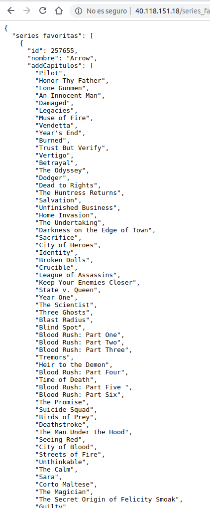


Seguidamente, se le añade una segunda funcionalidad y es el uso de una base de datos **PostgreSQL**. Esta base de datos se va a encontrar almacenada en una máquina virtual diferente a la del servicio y que nos almacenará los nombres y el id de las series que el usuario vaya añadiendo a sus favoritas.
Cuando queramos insertar una serie a la tabla de series que crearemos en el [playbook correspondiente](https://github.com/samahetfield/PersonalCC-1819/blob/master/orquestacion/postgre.yml), simplemente tendremos que realizar una **query** del siguiente tipo:

	client.query("INSERT INTO series(id, nombre) VALUES($1, $2)", [lastadded.id, serie_added]);

Donde el objeto **cliente** previamente se habrá conectado a la base de datos.

Para la conexión a la base de datos, se ha seguido este [tutorial](https://ed.team/blog/como-usar-bases-de-datos-postgres-con-nodejs).

Con el siguiente código, indicaremos el usuario, la IP a la que conectarse que como hemos visto anteriormente, la de nuestra Base de datos es la IP privada 10.0.0.5, la base de datos a usar, la contraseña del usuario y el puerto.
Postgresql nos crea por defecto un usuario llamado **postgres** sin contraseña, pero es necesario indicarle una contraseña si quieríamos conectarnos, por eso, en el Playbook cuando instalamos PostgreSQL, modificamos el usuario añadiendo una contraseña. El puerto de PostgreSQL es el 5432 y la base de datos por defecto creada también se llama postgres.

	const connectionData = {
		user: 'postgres',
		host: '10.0.0.5',
		database: 'postgres',
		password: 'psswrd',
		port: 5432,
	}


Por defecto, PostgreSQL no acepta las conexiones externas, por lo que es necesario hacer algunos cambios en sus archivos de configuración para que pueda recibir las peticiones desde una máquina remota.
Para ello en el playbook, se realizan estos cambios para que una vez provisionado esté todo correctamente funcionando.

Haciendo uso del comando **sed** de Ubuntu, así como de algunas páginas que me ayudaran como esta de [askubuntu](https://askubuntu.com/questions/20414/find-and-replace-text-within-a-file-using-commands) o [esta otra](https://www.cyberciti.biz/faq/how-to-use-sed-to-find-and-replace-text-in-files-in-linux-unix-shell/), podremos modificar líneas de código en estos archivos. 

	sed -i "s/#listen_addresses = 'localhost'/listen_addresses = '*'/" /etc/postgresql/10/main/postgresql.conf

En esta línea de código podemos ver que lo que hacemos es reemplazar la línea de código comentada de ``` #listen_addresses = 'localhost' ``` por una la línea de código siguiente ``` listen_addresses = '*' ``` para que no sólamente escuche de localhost. Esto se modifica en el archivo que se encuentra en la ruta especificada.

También es necesario modificar otro archivo y usaremos la siguiente orden:

	sed -i "s/127.0.0.1\/32/0.0.0.0\/0/" /etc/postgresql/10/main/pg_hba.conf

En esta orden modificamos que en lugar de permitir únicamente la IP 127.0.0.1 con puerto 32, lo abrimos para que acepte cualquier IP.


## Comprobación de la orquestación de un compañero

Se ha comprobado la orquestación del compañero Adrián de la Torre Rodríguez.
Para ello he descargado los ficheros existentes en su carpeta de orquestación y se ha ejecutado el Vagrantfile.

Se han seguido las instrucciones que se nos indican en su [documentación](https://github.com/adritake/CC_UGR_Personal/blob/master/docs/Orquestacion.md), donde vemos que es necesario exportar a un archivo JSON las variables que usaremos de Azure, así como el ID de nuestra subscripción a un archivo TXT.

Si ejecutamos el Vagrantfile tal y como lo descargamos, nos dará un error diciendo que hay un DNS con ese nombre, por lo que tendremos que cambiar el nombre de las máquinas para que no haya conflictos.

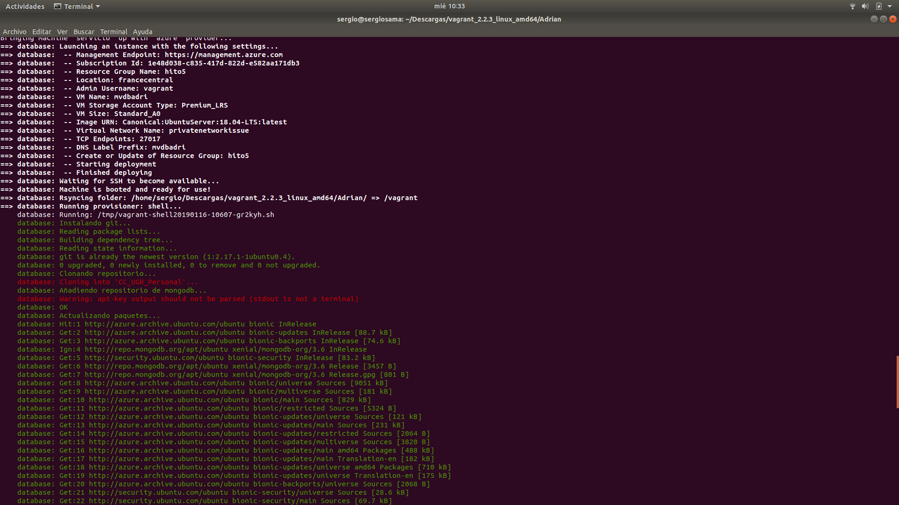

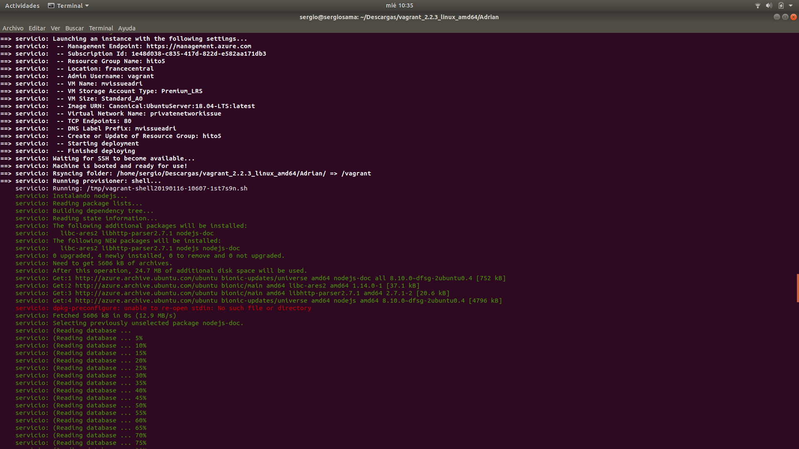

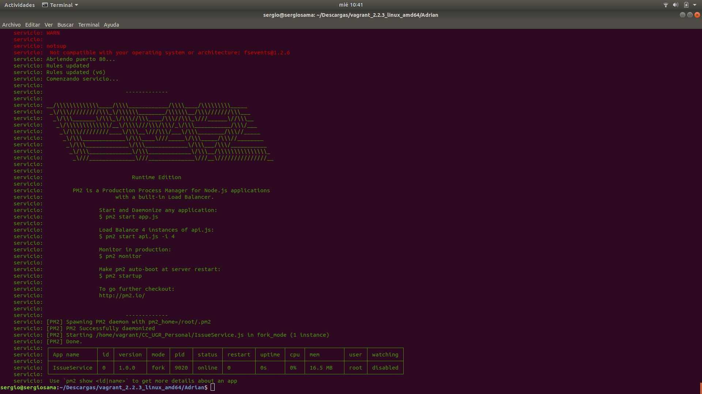


Una vez ejecutado el Vagrantfile y terminada la provisión de las máquinas, accederemos a la IP pública de la máquina que aloja el servicio y que tenemos en Azure para comprobar que funciona correctamente.


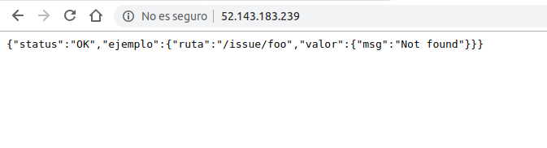

